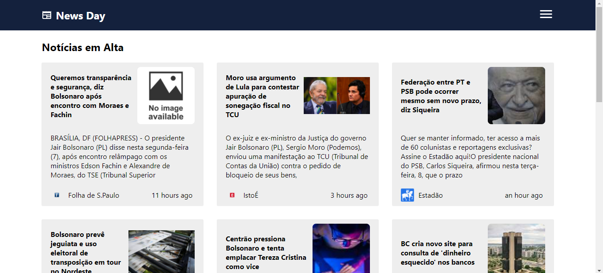

# News Day

> News Day

## ☕ Usando News Day

Para usar News Day, clique no link abaixo:

[![Abrir com Netlifly]](https://newsday-react-redux.netlify.app/)

## 💻 Tecnologias

As tecnologias utilizadas para construir o News Day foram:

- React
- JavaScript
- Redux Toolkit
- Styled Components
- Material UI

## 🤝 Colaborador

Agradecemos à seguinte pessoa que contribuíu para este projeto:

<table>
  <tr>
    <td align="center">
      <a href="https://github.com/gabomoreira">
         
        
          <b>Gabriel Moreira</b>
        
      </a>
    </td>
  </tr>
</table>
